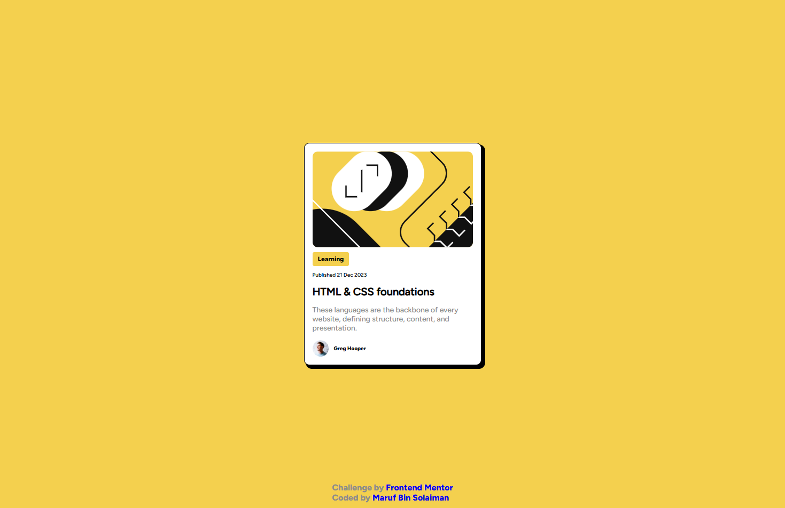

# Frontend Mentor - Blog Preview Card

This is my solution to the Blog Preview Card challenge from [Frontend Mentor](https://www.frontendmentor.io/). The goal was to recreate the provided card component as closely as possible using only HTML and CSS.

## Screenshot




## Links

- Solution URL: [GitHub](https://github.com/marufBS/frontend-mentor/tree/main/newbie/blog-preview-card)
- Live Site URL: [Vercel](https://blog-preview-card-mbs.vercel.app/)

## Overview

Users should be able to:

- View the blog preview card layout on different screen sizes
- See hover styling on the card title
- Experience a design that closely matches the Frontend Mentor reference

## Built With

- Semantic HTML5
- CSS custom styling
- CSS Grid
- Flexbox
- Responsive layout with media queries
- Local Figtree font files

## Project Structure

```text
.
|-- assets
|   |-- fonts
|   `-- images
|-- index.html
|-- styles.css
`-- README.md
```

## Getting Started

This is a static HTML and CSS project, so no build tools are required.

1. Clone the repository.
2. Open `index.html` in your browser.
3. Edit `index.html` or `styles.css` to customize the project.

## What I Learned

While building this challenge, I practiced:

- Structuring a simple card component with HTML
- Centering content using CSS Grid
- Using local font files with `@font-face`
- Creating a responsive layout for smaller screens
- Matching spacing, colors, typography, and shadows from a design reference

## Continued Development

Things I may improve later:

- Add a final screenshot to the README
- Publish the project with GitHub Pages, Netlify, or Vercel
- Refine small responsive spacing details
- Improve accessibility text for decorative and content images

## Author

- [Github Profile](https://github.com/marufBS)
- [Frontend Mentor Profile](https://www.frontendmentor.io/profile/marufBS)

## Acknowledgments

Thanks to [Frontend Mentor](https://www.frontendmentor.io/profile/marufBS/) for providing the challenge design and assets.
